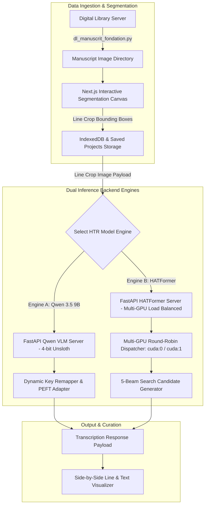

# BNF Manuscripts POC

An AI-powered manuscript ingestion, page & line segmentation, dataset curation, and multi-model Vision HTR inference platform designed for historical Arabic Handwritten Text Recognition.

This repository features an interactive web interface for **page and line bounding-box segmentation**, an automated digital manuscript scraper, and two production-grade backend inference APIs powered by fine-tuned vision models (`Qwen 3.5 9B` via `Unsloth` and `HATFormer` across multi-GPU environments).

---

## 🚀 Key Technical Features

### 1. ✂️ Interactive Page & Line Bounding-Box Segmentation

* **Visual Line Bounding-Box Segmentation Engine:**
  * Interactive canvas allowing users to segment full manuscript pages into individual line crops (`exportSegmentedImages`).
  * Real-time line crop extraction and storage using IndexedDB and local disk workspace persistence (`/saved_projects/`).
  * Bulk export utilities (`bulkExportProjects`) for generating line-level HTR dataset annotations.

---

### 2. ⚡ Dual-Model Vision HTR Inference APIs

* **Qwen 3.5 9B Vision-Language LLM Backend (`api_qwen_htr.py`):**
  * Serves custom fine-tuned adapters (`checkpoint-200`) trained on Arabic manuscript lines (~11K annotated line dataset).
  * 4-bit quantized loading using `Unsloth` (`FastVisionModel`) for low-VRAM inference execution.
  * Automated prefix detection (`find_prefix`) and dynamic key remapping to bridge adapter name mismatches across `transformers` and `peft` versions.
  * Dynamic pixel constraint limits (`MAX_PIXELS = 602112`, `MIN_PIXELS = 28 * 28 * 64`) to prevent GPU OOM errors.

* **HATFormer Multi-GPU Load Balanced Backend (`api_htr.py`):**
  * `VisionEncoderDecoderModel` (`HATFormer`) architecture trained specifically for sequence-to-sequence Arabic script recognition.
  * **Multi-GPU Load Balancing:** Automatically detects available GPUs (e.g. 2x RTX 3090) and distributes model instances across `cuda:0` and `cuda:1` using round-robin request dispatching (`get_next_model`).
  * **Beam Search Decoder:** Runs 5-beam search (`NUM_BEAMS=5`) returning top candidate sequences (`NUM_RETURN_SEQUENCES=3`) alongside sequence-level log-probability scores.
  * Specialized aspect-ratio resizing, image flipping, and segment patching to preserve recognition accuracy.

---

### 3. 🌐 Digital Library Document Scraper (`dl_manuscrit_fondation.py`)

* Automated batch manuscript downloader for digital library APIs (e.g. *Fondation Roi Abdul-Aziz*).
* Zero-padding preservation (`zfill`), timeout retry handlers, and chunked stream writes.

---

## 🛠️ System Architecture



---

## 💻 Tech Stack

* **Machine Learning Frameworks:** PyTorch (CUDA), Unsloth (`FastVisionModel`), PEFT (LoRA/QLoRA), Transformers (`VisionEncoderDecoderModel`), BitsAndBytes, Torchvision.
* **API Backend:** FastAPI, Uvicorn, Pydantic, Pillow, Requests, Asyncio.
* **Frontend UI:** Next.js (App Router), React, TypeScript, Tailwind CSS, Lucide React, IndexedDB (`storage.ts`).

---

## ⚙️ Quick Start

### 1. Ingest Manuscript Scans
```bash
python dl_manuscrit_fondation.py
```

### 2. Launch the HTR Inference Backend
*To launch Qwen 3.5 9B VLM:*
```bash
python api_qwen_htr.py
```

*To launch HATFormer Multi-GPU engine:*
```bash
python api_htr.py
```

### 3. Run the Next.js Web Interface
```bash
npm install
npm run dev
# Open http://localhost:3000 in your browser
```